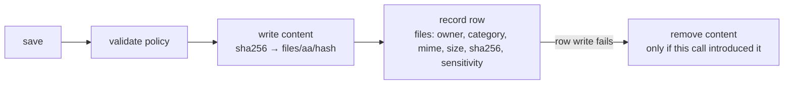

# Desktop-local storage (Phase 6.3)

Where the shell keeps its database and its files, why those locations are what they are, and what
holds the two halves of a stored file together.

Status legend used below: **Implemented** · **Partial** · **Deferred** · **Requires review**.

---

## 1. The rule everything follows

**The data does not live next to the code.**

An installer upgrade replaces the program directory. A repository checkout is a working tree someone
will `git clean`. A portable build may be run from a USB stick. In all three, a database resolved
against the current working directory is a database that will one day be erased by something
unrelated to the product. So every shell-owned path is derived from the **OS application-data
directory**, resolved once in `src/desktop/data-paths.ts` and never from `process.cwd()`.

The default configuration still carries `database.file = 'data/master-trade.db'` and
`storage.root = 'data/files'`. Those are the **server's** defaults and remain repository-relative,
which is correct for a self-hosted instance. The desktop shell does not use them: it opens its own
file, by path, through the same `openDatabase()` the server uses.

|         | Location                                                                            |
| ------- | ----------------------------------------------------------------------------------- |
| Windows | `%APPDATA%\Master Trade\data\<environment>\`                                        |
| macOS   | `~/Library/Application Support/Master Trade/data/<environment>/`                    |
| Linux   | `$XDG_CONFIG_HOME/master-trade/data/<environment>/` (or `~/.config/master-trade/…`) |

Three properties are load-bearing:

- **Deterministic.** The path is a pure function of platform, environment and environment variables.
  No probing, no "first writable location wins", no temp-directory fallback — a path that depends on
  what happened to be on disk differs between two launches of the same build.
- **Environment-separated.** `development`, `test` and `production` are disjoint subtrees, not three
  files in one directory. A development launch can neither open nor migrate the database a user's
  real history lives in, and a cleanup of one mode's directory cannot touch another's.
- **Server-only.** These modules live under `src/`, which the frontend cannot reach: the `@shared/*`
  alias map is exact-match (ADR-0035), so no UI bundle can import a path resolver and no browser
  runtime can resolve a desktop filesystem path.

---

## 2. Database location and initialization

`src/desktop/initialize.ts` exposes `tryInitializeDesktopStorage()`, which resolves paths, opens the
database and applies pending migrations, and returns **a result value rather than throwing** on the
failures the shell must render:

```
{ ok: true,  environment, environmentDeclared, paths, database }
{ ok: false, environment, environmentDeclared, paths | null, failure: { stage, code, reason } }
```

Three stages, because they need different words on screen and different remedies:

| Stage        | Meaning                                                                             | Nothing was opened?    |
| ------------ | ----------------------------------------------------------------------------------- | ---------------------- |
| `paths`      | the OS would not say where app-data is (an unset `APPDATA`/`HOME`)                  | yes — no file touched  |
| `database`   | the file could not be opened (driver absent, permissions, a directory in its place) | the file was attempted |
| `migrations` | the database opened and was then **refused** (see §3)                               | opened, then refused   |

`failure.reason` is **curated, never forwarded**. A driver error can contain an absolute path and the
shell prints these into a window, so the reason names the condition while the paths stay on the
success value, where a caller that needs them can see them.

**Implemented.** `initializeDesktopStorage()` is the same call for a caller that would rather the
failure throw.

---

## 3. Migration lifecycle

There is **no new migration mechanism**. The runner from Phase 3.4 (`src/db/runner.ts`) is reused
unchanged, and this phase only classifies its refusals so the shell can report them:

- each migration runs **inside a transaction** and is recorded in `schema_migrations` with a checksum
  of the statements actually run for that dialect;
- a **checksum mismatch** (an applied migration was edited) is refused;
- a migration the **code does not know** (a database written by a newer build) is refused;
- a database **newer than the code** is refused.

The refusal is the point. The alternative — silently dropping and recreating — would resolve a
version conflict by deleting the user's history. So `migration corruption → startup failure state`
is a deliberate product decision, not an accident of implementation, and it is asserted: a tampered
ledger is `ok: false, stage: 'migrations', code: 'CONFLICT'`, and the reason names the migration id
and never the path.

Repeated execution is safe — a second open applies nothing (`appliedNow: []`) — and restart
persistence is covered by writing through one handle, closing it, and reading back through a second.

**Implemented.** Backup and restore are **deferred** (§9).

---

## 4. File storage root

Files live under `<dataRoot>/files`, a **content-addressed** store: the key is the SHA-256 of the
content and the path is derived from the first two hex characters, giving a two-level fan-out.

```
<dataRoot>/files/<aa>/<aaf3…>      # content, addressed by its own hash
<dataRoot>/files/<aa>/.tmp-…       # a write in flight
```

The layout follows the schema, not convenience: the `files` table comment says _"bytes live in
managed storage keyed by content hash"_. Two consequences:

- **Writing the same bytes twice writes one file.** Identical content from two owners is stored once.
- **There is no name to guess.** A key that was never written cannot be read by inventing a path,
  because the only path that reads is one whose content hashes to what was asked for.

Writes are **atomic**: content is written to a temporary file in the target directory and renamed
over the final name. A crash mid-write therefore leaves a stray temporary — which `list()` ignores
and `reconcile` can sweep — rather than a truncated blob that hashes to something it is not.

**Implemented.** `DiskBlobStore` in `src/storage/disk.ts`.

---

## 5. Path security

There is **no API that accepts a path**. `DiskBlobStore`'s only accepted key is 64 lowercase hex
characters, and the only callers that build a path do so from that key. There is therefore nothing to
traverse _from_.

`assertContainedPath(root, relative)` is the second line, for any future caller that passes a
relative name. It refuses, in order: a NUL byte (which can truncate a path in a lower layer); an
absolute path (a caller naming a location rather than a key); a normalized path that still begins at
`..`; and — the check that makes the others belt-and-braces — a resolved path that is neither the
root nor under it. The final check is what catches platform spellings the earlier ones can miss.

No path is exposed to the frontend. The `files` table stores no path and no storage key, only the
hash; the shell owns location and the database owns attribution.

**Implemented.** Covered by tests that attempt traversal explicitly.

---

## 6. Metadata ↔ file relationship

A stored file is two facts in two places. `ManagedFileStore` (`src/desktop/file-store.ts`) is the
**only** code that writes both, so an operation that touches one and not the other cannot be written
by accident.



| Relationship                | Where it is kept                              | Enforced by                                                                       |
| --------------------------- | --------------------------------------------- | --------------------------------------------------------------------------------- |
| **owner/context**           | `files.owner_id` (FK → `users`)               | `meta`/`read`/`delete` take an owner and return nothing for anyone else           |
| **type**                    | `files.category`, `files.mime_type`           | validated against the storage policy before any write                             |
| **size / content identity** | `files.size_bytes`, `files.sha256`            | the key is recomputed from the bytes, so the row cannot disagree with the content |
| **sensitivity**             | `files.sensitivity` (`normal` \| `sensitive`) | `storage/files.ts` refuses `sensitive` while `allowSensitiveFiles` is false       |
| **timestamps**              | `files.created_at`                            | written once, at record time                                                      |

**A row belonging to another owner is indistinguishable from a row that does not exist.** Returning
`null` for both, rather than an error for one, means the check cannot be used to probe whether a
file id exists under someone else's account.

**Content is shared but attribution is not.** Two owners saving identical bytes produce two rows and
one blob; deleting one row keeps the content, because `countFilesWithHash()` says another row still
references it. Deleting the last row removes the content.

### The four partial-write failures it closes

| Failure                        | Outcome                                                                                                                      |
| ------------------------------ | ---------------------------------------------------------------------------------------------------------------------------- |
| content write fails            | nothing is recorded — the row is written only after the content exists                                                       |
| metadata write fails           | content this call introduced is removed; content that already existed is left alone, because it may back another owner's row |
| row exists, content missing    | `read` **throws** rather than returning empty, and `verifyIntegrity` names the row                                           |
| delete crashes between the two | an **orphan blob** — invisible to readers, reclaimable by `reconcile`                                                        |

The delete order is deliberate and asymmetric: metadata first, content second. Losing the row first
leaves an orphan blob, which is invisible and reclaimable; deleting the content first would leave a
row pointing at nothing, which is a visible failure every time it is read.

**Implemented.** Quota enforcement above the per-file limit is **deferred** (§9).

---

## 7. Recovery behaviour

`verifyIntegrity(ownerId?)` reports two lists without changing anything:

- `missingContent` — rows whose content is absent. **Scoped to `ownerId`** when given.
- `orphanContent` — content no row references. **Never scoped**, because a blob is referenced if
  _any_ row names it; a per-owner view would report other owners' live content as orphaned and invite
  a scan to delete it.

`reconcile({ removeOrphans })` runs the same scan and **does not delete unless asked**. A scan is not
a destructive act.

Restart after an interrupted operation is the tested path: write through one store, close it, remove
one blob from disk, reopen — the scan reports that row as missing, and the metadata is still there
and still owned, because the scan reports rather than hides.

**Implemented.** Automated re-download or re-fetch of missing content is **deferred** — the product
has no remote source of a stored file's content to re-fetch from.

---

## 8. Browser vs desktop separation

|                      | Browser (web)                                                             | Desktop shell                                   |
| -------------------- | ------------------------------------------------------------------------- | ----------------------------------------------- |
| Database             | the configured server file, or the deployed server's database             | `<app-data>/data/<environment>/master-trade.db` |
| Files                | server-side storage                                                       | `<app-data>/data/<environment>/files`           |
| Path resolution      | not applicable                                                            | `src/desktop/data-paths.ts`                     |
| Can import the above | **no** — `@shared/*` is exact-match, so `src/` is unreachable from `web/` | yes, server-side                                |

The web application remains fully functional and unchanged. No browser runtime attempts to open a
local database or write to a desktop path, because no frontend module can import the code that does.

---

## 9. Deferred, by phase

The rows are grouped by where the remaining work sits, and each says what it is _not_, because two
distinct capabilities are easy to confuse here: **Phase 6.4 put credential values in the OS
keychain**; it did **not** encrypt the database or the content store at rest. Those are separate,
and this file's data is covered by neither (TDR-14).

| Item                                                                           | Phase               | Why it is not here                                                                                                                                                                                |
| ------------------------------------------------------------------------------ | ------------------- | ------------------------------------------------------------------------------------------------------------------------------------------------------------------------------------------------- |
| Backup, restore, export, import                                                | 6.3 (partial)       | Needs a user-facing format and a retention decision; the store is already safe to copy                                                                                                            |
| Per-owner storage quota and eviction                                           | 6.3 (partial)       | The policy holds a total-bytes ceiling; enforcement against it is not wired                                                                                                                       |
| Migrating an existing `data/` repository database into app-data                | 6.3 (partial)       | No existing desktop release has a database to migrate                                                                                                                                             |
| **Encryption at rest for the database and the content store**                  | **Not scheduled**   | A different capability from the keychain: Phase 6.4 seals credential _values_ in the OS keychain; it does not encrypt this file or these blobs. SQLCipher would be a dependency decision (TDR-14) |
| Credential management surface (grant/revoke UI), automatic credential rotation | 6.6 / later         | The OS keychain itself is **implemented** (Phase 6.4, [desktop-secure-storage.md](./desktop-secure-storage.md)); what is missing is the workflow surface around it                                |
| Installer, signing, auto-update                                                | 6.5                 | —                                                                                                                                                                                                 |
| Final hardening and release QA                                                 | 6.6                 | —                                                                                                                                                                                                 |
| Visual redesign, component library                                             | Design system phase | —                                                                                                                                                                                                 |

---

## 10. Known limitations

1. **The desktop database is single-process.** SQLite is opened by the local API process; the shell
   itself does not open it. A second instance is prevented earlier, by the single-instance check in
   the lifecycle, not by the database.
2. **`node:sqlite` availability is environmental.** On a runtime without it the failure is reported
   as `stage: 'database'`, with an honest reason, rather than a crash at import time.
3. **Encryption at rest is absent.** Content is stored as written; anything sensitive depends on OS
   filesystem permissions and the `sensitive` policy refusal (which is off). **Requires review**
   before real user data.
4. **Orphan content is only reclaimed when a scan is run.** There is no scheduled sweep; `reconcile`
   is the manual entry point.
5. **Content is stored uncompressed and undeduplicated by similarity.** Only byte-identical content
   shares a blob. This is a size trade-off, not a correctness one.

---

## 11. Where this is tested

`tests/desktop-storage.test.ts` — 30 tests:

- **paths** — app-data resolution, environment disjointness, determinism, platform-specific bases,
  an unsupported platform refused, and that the desktop file is _not_ the repository-relative default;
- **initialization** — open and migrate, restart persistence, a tampered ledger refused with the
  migration named and the path absent, a newer-build database refused, an in-place directory reported
  as `database` without leaking the path, unresolvable paths as their own stage, and an unrecognised
  environment treated as development in its own directory;
- **containment** — traversal, absolute paths, NUL bytes, and non-hash keys refused;
- **blob store** — content addressing, deduplication, stray/temporary files ignored, removal and
  misses, an empty root;
- **managed store** — save/read round-trip, filename sanitization, cross-owner refusal, shared
  content kept until the last reference, missing content detected and never silent, orphans reported
  and only removed on request, no metadata after a failed content write, no orphan after a failed
  metadata write, recovery across a restart, policy refusal, and owner-scoped integrity.
